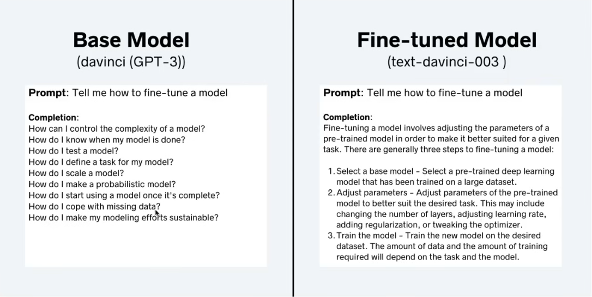

# Fine Tuning an LLM

## What is Fine Tuning ?

Fine Tuning a model is the process of taking a pre-trained model and adapting it
to a specific task by continuing training on a smaller, task-specific dataset.  
The goal is to adjust the model's weights or biases slightly to improve
performance on the new task without starting from scratch.

Fine Tuning can outperform a Larger Base Model

## Types of Fine Tuning

### 1. **Self-Supervised Fine-Tuning**

The model is first trained on a large dataset without explicit labels. The model
learns useful representations by predicting part of the input, such as masked
words in a sentence or the next frame in a video. Later, it is fine-tuned on a
smaller labeled dataset for the target task.

- **Example**: You want to train a model to classify email content as spam or
  not.

- **Pre-training**: You start with a BERT model that was trained on a large text
  corpus, where the model had to predict missing words in sentences, like: Input
  sentence: "The cat sat on the [MASK]." Model predicts: "[MASK] = mat."
- **Fine-tuning**: You then fine-tune this model on a labeled dataset of emails
  where each email is labeled as spam or not. The model uses what it learned
  about language patterns during pre-training to improve its classification
  performance.

### 2. **Supervised Fine-Tuning**

The model is pre-trained on a large dataset and fine-tuned using labeled data
for a specific task. The labeled data helps adjust the model’s weights to
improve performance on the target task.

- **Example**: You have a dataset of images to detect skin cancer.

- **Pre-training**: You use a ResNet model pre-trained on ImageNet, which
  learned to classify objects like cats, dogs, and cars. Input: Image of a cat.
  Model predicts: "Cat."
- **Fine-tuning**: Now, you fine-tune this ResNet model on a labeled dataset of
  skin lesion images. For each image, you have labels like "benign" or
  "malignant." The model adjusts its knowledge of image features to focus on
  medical diagnosis.

### 3. **Reinforcement Learning Fine-Tuning**

The model fine-tunes by interacting with an environment and receiving rewards or
penalties based on its actions. Fine-tuning happens by adjusting the model's
policy to maximize cumulative rewards.

- **Example**: You’re building an AI to play a strategy video game.

- **Pre-training**: You start with a model trained on recorded games, so it
  knows basic game moves and strategies. Input: Current game board position.
  Model suggests: "Move knight to E5."

- **Fine-tuning**: You fine-tune it using reinforcement learning by letting it
  play thousands of games. Each time the model wins or loses, it gets a reward
  or penalty. Over time, it adjusts its strategies to maximize winning and
  minimize losing.

## Steps for Supervised Fine Tuning

1. Choose the fine tuning task
2. Prepare training dataset
3. Choose a base model
4. Fine tune model via supervised learning
5. Evaluate model performance

## Options for Parameter Tuning

### 1. Retrain All Parameters

In this method, you fine-tune all layers of the pre-trained model on your new
dataset. The model’s entire set of parameters (weights) is updated during
training to adapt fully to the new task.

_High cost, high flexibility but resource-intensive_

### 2. Transfer Learning

In transfer learning, you freeze the early layers of the pre-trained model
(which capture general features) and only fine-tune the last few layers
(task-specific layers).

_Medium cost, strikes a balance between performance and efficiency_

### 3. Parameter-Efficient Fine-Tuning (PEFT)

PEFT is a method where only a small set of additional parameters (such as
adapters or low-rank layers) are added to the model, and only these parameters
are trained while the original model weights are largely frozen.

_Low cost, highly efficient for fine-tuning large models with minimal resources_

#### LORA - Low Rank Adaptation is a type of PEFT

[*readmore*](./LoRA.pdf)

## References

1. Shaw Talebi, “Fine-tuning Large Language Models (LLMs) | w/ Example Code,”
   YouTube. Oct. 01, 2023. Available:
   <https://www.youtube.com/watch?v=eC6Hd1hFvos>
2. ChatGPT. <https://chatgpt.com>
